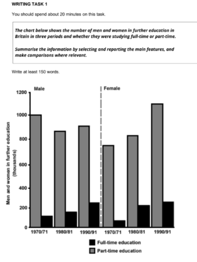
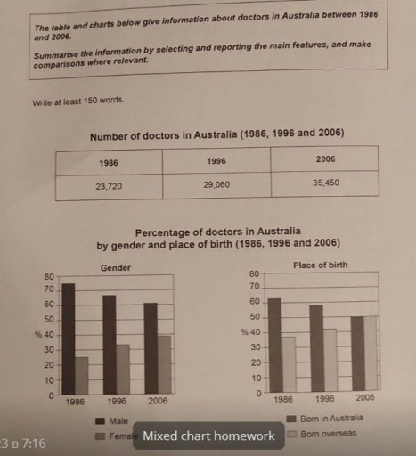

# Bar chart 

### By Jeremy

The diagram provides the information of full-time and part-time of individuals in two kinds of gender in the UK from 1970 to 1990.

Overall, it is clear that there were radical difference in the data, with the slightly decreased in data of male students part-time and the remarkably increased in data of male students counterpart. In the same time surveyed, both types of female students have significantly increased.

In 1970, the number of male students studying part-time is 1000000. In contrary, the full-time students was much lower, nearly one-ten compared to its counterpart. While number of male part-time student in 1980 have a slightly decreased, around 850 thousands of students, the number of male full-time student was nearly 200 thousands individuals. This category have an significant increase in 1990 and 1991, around 300 thousands, which was double as much as students studying part-time compared to 1970 and 1971. 

When it come to female category, the number of part-time students was nearly 800 thousands of students. In the next ten years, the number of female student studying full-time increased significantly from nearly 70 thousands of students in 1970 and 1971 to 250 thousands of individuals in 1980 and 1981. In the same period, the part-time students had a slightly increase, around 850 thousands of students. Meanwhile, in 1990 and 1991, the number of students who studying part-time have an remarkably change, its data jumped dramatically from 850 to 1100 thousands of students from 1980 and 1981 to 1990 and 1991 respectively, and the figure of female student studying part-time remained unchanged compared to its data in 1980 and 1981. 

- [x]     Overall: 5.5 
- [x]     Coherence and Cohesion: 5.5 
- [x]     Resource: 5.5
- [x]     Grammatical Range and Accuracy: 5.0  
- [x]     Task Achievement: 5.0

#### Correction

-  [v] The diagram provides the information of full-time and part-time of individuals in two kinds of gender in the UK from 1970 to 1990. 

The diagram provides information about the number of full-time and part-time in two kinds of gender in the UK from 1970 to 1980. 

the information of $\to$ information about.

two kinds of gender $\to$ by gender or male and female.

individuals $\to$ students.

-  [v] Overall, it is clear that there were radical difference in the data, with the slightly decreased in data of male students part-time and the remarkably increased in data of male students counterpart. In the same time surveyed, both types of female students have significantly increased.

Overall, there was a significant difference in the trends, with a slight decrease in the number of male and part-time students and a remarkable increase in male full-time students. During the same period, the number of both part-time and full-time female students increased significantly.

radical difference $\to$ a slight decrease in the number of ...

male students counterparts $\to$ male full-time students.

### By AI

The diagram illustates the number of male and female in the UK pursuing full-time and part-time education between 1970 and 1990.

Overall, it is clear that both male and female students saw an increase in full-time study during this period, with female part-time education also rising significantly. In contrast, male part-time enrolment experienced a slightly decline.

In 1970, approximate ly 1,000,000 males were enrolled in part-time education, while only around 100,000 were studying full-time. By 1980, the number of male part-time students had dropped to about 850,000, whereas full-time enrolment rose to nearly 200,000. This upward trend continues in 1990, reaching about 300,000 full-time male students. 

For females, part-time enrolment started around 800,000 in 1970 and increased slightly to 850,000 in 1980. A more significant jump occurred in 1990, whe the number reached 1.1 million. Meanwhile, the number of female students in full-time education showed consistent growth from approximately 70,000 in 1970 to 250,000 in 1980, and remained stable at that level in 1990

### By AI 

### By Jeremy

The table illustrates how many doctors worked in Australia from 1986 to 2006, while the two bar charts depict the proportion of those individuals, divided by gender, and where they were born.

Overall, it is clear that the number of doctors in Australia witnessed an upward trend over the period. Additionally, despite experiencing different changes, male doctors, outnumbered their female counterparts. Besides, the majority of doctors were born in Australia.

When it comes to the table, there were 23720 doctors in Australia in 1986. From 1986 to 1996, there was a slight increase of about 6000 doctors in Australia before it reached the highest figure of 35450 in 2006.

Regarding the bar graph, more than 70% of doctors are male, which was three times higher than the percentage of female doctors in 1986. Throughout the span of time, while the figure for male doctors decreased slowly to 62%, the percentage of female doctors rose slowly to about 40%. When it comes to where they were born, in the first year, the proportion of doctors who were born in Australia was more than 60%, which was twice as much as the figure for doctors born overseas. Despite undergoing the opposite trend, their figures hit the same point of 50% in the end.

![[Pasted image 20250624214741.png]]

Overall, it is clear that all fields witnessed an increase in income except for tourism over the period. Financial services field had the highest income, with telecommunications coming in second, while tourism recorded the lowest values in both 2000 and 2010. In addition, there were slightly differences in the data between three fields, administration, transport and retail/shops.

[Overview brief](Overview%20brief.md)
[Vocabulary](Vocabulary.md)
[Grammar](1747063027-COCD.md)
[2025-05-14](2025-05-14.md)
