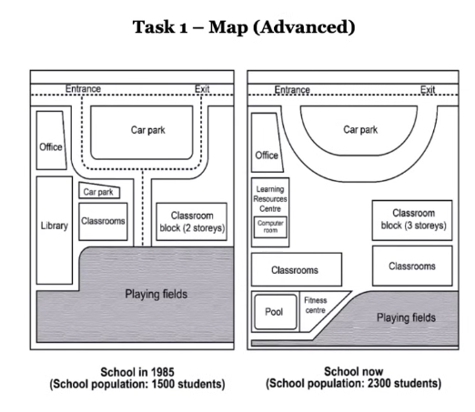
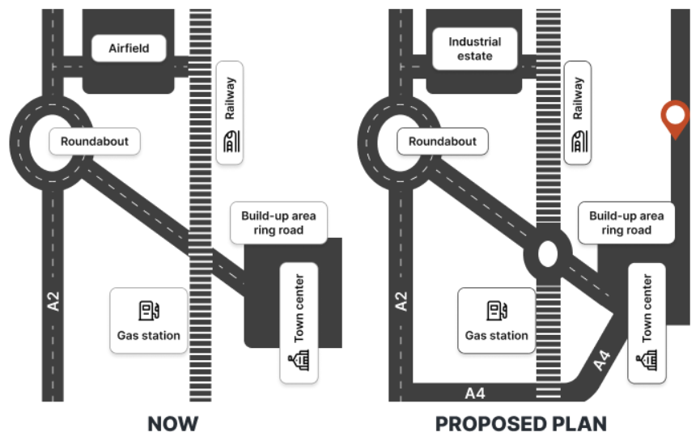
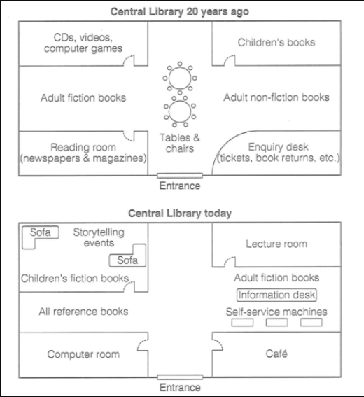

# Map 1

### Main
#### Nửa dưới
- Playing fields $\to$ bị nhỏ đi
- Trái $\to$ classrooms/pool/fitnes centre
- Phải $\to$ dãy phòng học có  tầng, thì nay thành 3 tầng và có thêm 1 dãy classroom nữa ở bên cạnh.

There are several changes at the bottom half of the campus. The playing field have their sizes reduced to accommodate more construction. On the left side, a block of new classrooms has been built, along with a fitness centre and a swimming pool. On the right side, the previous set of classrooms that had two storeys now have one more level added to it, and a new block of classrooms has been erected next to it. 
$\to$ Overall, a prominent area in this campus has undergone a size reduction that helps more buildings to be constructed

#### Bên trái
- Office giữ nguyên
- Library thành learning resources centre + computer room
- Car park/ classrooms bị removed.

The removal and modernization of some facilities have also been witnessed on the left and middle part of the school. The library has been upgraded and become a learning resources centre that has a built-in computer room. While the office nearby remains, the car park and the classrooms on the right side of the library have been eliminate. Furthermore, the central car park transforms from square to cirlce and its middle road that used to connect it with the playing fields have been removed.
$\to$ Overall, an old learning facility has been modernized, while the internal movement infrastructure has been modified.

Thanks to all new facilities and classrooms, the population of this school has improved from 1500 to 2300 students.

### Overview
 Overall, a prominent area in this campus has undergone a size reduction that helps more buildings to be constructed, while an old learning facility has been modernized, while the internal movement infrastructure has been modified.

# Map 2
****

### By Jeremy

The plans depict how the layout of a town named Hunderstone will change in the future compared to the present day. Overall it is clear that there will be radical changes in the layout of the town with the most noticeable being the removal of the air field, the addition of a industrial estate , the expansion of the transport system and the size reduction of the built-up area. 

At present, there arae the air field in the North west, which is linked to the A2 road, running from the North West to the roundabout in the West to South West and the railway which is set up from the North to the South. According to the proposed plans, while the roundabout and the A2 road will remain unchanged, the aird field will be converted to an industrial estate. At the same time, the railway is planned to be extended Northward and there will be a side road built to link the industrial estate with these two roads.

Meanwhile, in the East, the town center and the ring road will witness no change, whereas the build-up area, which currently surrounds them, will be narrowed down to its North. In the middle of the map, while the gas station will still stand there, another roundabout will be added on the railway and it will be linked to the A2 road and the  by two side roads. Along with the mentioned roads, the A4 road is expected to be built from the A2 road to the town center, while the main road will also be established from the ring road to an out-of-town area, all of which will facilitate the transport of the whole town.

### By AI

The maps illustate a number of proposed changes that are to take place in the town of Hunderstone. 

In general, while the area to the east of the railway will remain almost the same, the western side is going to undergo several significant changes, especially with regards to the transport infrastucture.

As can be seen in the first map, Hunderstone Town is currently divided into two main areas by a railway line, which runs from north to south and passes by a gas station. To the west of the railway, there is an air field which is connected to the main road (A2). A roundabout in the miidle of this road connects the A1 road to the east of the town, and in particular, to the ring road around the town centre.

In the future, the air field in the north west of Hunderstone Town is expected to be replaced by an industrial estate. A new railway line will also be constucted to provide further acces to this area. In addition, a new, larger roundabout will be constucted midway along the road connecting the east and west of the town. A new road (A4) which will connect the A1 to the town centre will also be built in the south of the town.

The two maps illustrate the transformation of the city library's floor plan over the past 20 years. Overall, it is clear that there has been radical changes in the layout of the library, with the most noticeable being the removal of the CDs, videos and computer games area, the children's books room, the enquiry desk and the reading room, the rearrangement of the adult books areas, the addition of a story-telling area, the lecture room, a computer room, a cafe and an all reference book area, making it more modern and user-friendly.

Two decades ago, the library's layout included sections for CDs, videos, computer games in northeastern corner and the children's book area in the opposite. According to the current plans, while the CD, video and computer game areas has been replaced by a story-telling area including two sofas, a story-telling area and a children's fiction book area, the area on the opposite site has been removed to make way for a lecture room.

Meanwhile, the adult fiction book area in the West and the adult non-fiction in the East have been merged into an adult book area with the addition of an information desk and self-serivice machines in the East, an all reference book area has appeared at the original site of the former of the adult fiction book area. In the South the reading room and the enquiry desk on both sides of the entrance have been turned into a computer room and a cafe in southwestern corner and southeastern corner, respectively.  

[Overview brief](Overview%20brief.md)
[Vocabulary](Vocabulary.md)
[Grammar](1747056025-OUCO.md)

