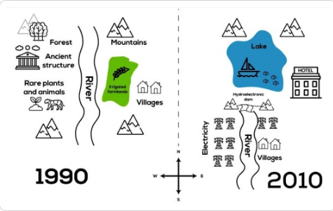

# Map, time

### The maps below show the changes in a town after the contruction of a hydroelectric power dam.

#### By Jeremy
The figures illustate how the layout of a town changed in 2010, compared to 1990.

Overall, it is clear that there were radical changes in the layout of the area, with the most noticeable being the disappearance of the forest, the ancient structure, the area of rare plants and animals and the irrigated farmland, and the addition of a hotel, electricity poles, a lake and a dam and the change of the relocation of the village.

In 1990, there was a river that flowed from north to south and split in two the whole town. In the north west, there was a forest standing next to an ancient structure, opposite to them were the irrigated farmland and villages. The area of rare plants and animals located at the western part in front of a range of mountains. 

By 2010, the area underwent a noticeable transformation which can be seen in the placement of structures on the left side of the river ran into electricity poles and the expansion southward of the whole area. On the contrary, while the four mountains still stood there and the villages which remained unchanged, were moved to the riverside, a hotel was built on its original site in the east and the irrigated farmland was converted into electricity poles. The emergence of the lake with fishing purposes resulted in the appearance of a hotel to accomodate housing demand for visistors coming here for fishing.
