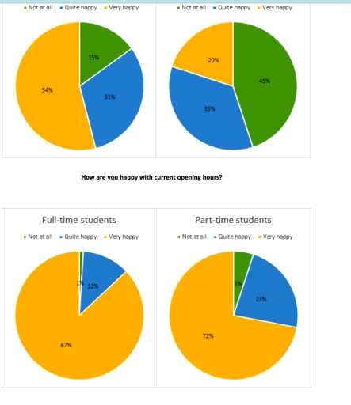
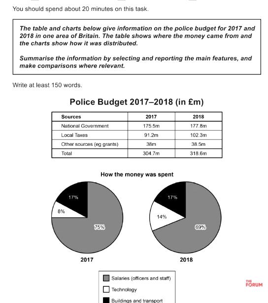

# Compared pie chart no time

### By Jeremy

The pie chart illustrate the proportion of full time and part time students who gave their feedback on two kind of services of their university's library.

Overall, it is clear that most full-time students were satisfied with IT support offered in their university's library, while the difference in the satisfaction of part-time students was quite small. Additionally, the majority of students from both types of students gave good feedbak about opening hours of the library.

When it comes to IT support, the data for unsatisfied part-time students was 45%, three times as much as the data for full-time students with the same views. At the same time, a similarity was recorded in the figure for both types of students who said that they were quite happy, at nearly 35% each. Meanwhile, the number of full-time students who felt very pleased accounted for 15%, compared to only 20% of part-tie students who had the same feedback.

Regarding opening hours, 87% of full-time students reported that they felt very satisfied, which was 15% hight than the percentage of part-time students with the same opinion. 12% was the data for quite happy full-time students, while the figure for part-time ones who agreed with this view was nearly double. The lowest figure belonged to both types of students who were unsatisfied with only 5% of part-time students and only 1% for their full-time counterparts.

- [x]     Overall: 5.5 
- [x]     Coherence and Cohesion: 5.5 
- [x]     Resource: 5.5
- [x]     Grammatical Range and Accuracy: 5.0 
- [x]     Task Achievement:  6.0

### By AI

The two pie charts illustrate how full-time and part-time students rated two types of services provided by their university's library: IT support and opening hours.

The diagrams illustrate the proportion on the individuals budget in Britain/UK from 2017 to 2018.

Overall, it is clear that most of money income was from National Government and local taxes, while the difference in other resources quite small. Additionally, most of money was spent for paying the individuals and the increases of the data for money spent on technological categories.

When it comes to the table diagram, while 175.5m is given for police categories from the National Government, the Local Taxes and other resources has slightly increases from 91,2m to 102,3m and 38m to 38.5m from 2017 to 2018, respectively, resulted in the total income increases from 304.7m to 318.6m in the same period.

Regarding how the money was spent, 75% and 69% was the data of money spent reported that was used for pay the polices in 2017 and 2018 respectively. 14% of money income was used on technological categories in 2018, which was nearly double as much as its data in 2017. The data of money spent on buildings and transports remained unchanged, which was 17% in both 2017 and 2018. 

Paraphrase: depicts/provides information

- [x]     Overall:  
- [x]     Coherence and Cohesion:  
- [x]     Resource: 
- [x]     Grammatical Range and Accuracy:  
- [x]     Task Achievement:  

[Overview brief](Overview%20brief.md)
[Vocabulary](Vocabulary.md)
[Grammar](1747062946-IRJM.md)
[Education](2025-05-13.md)
