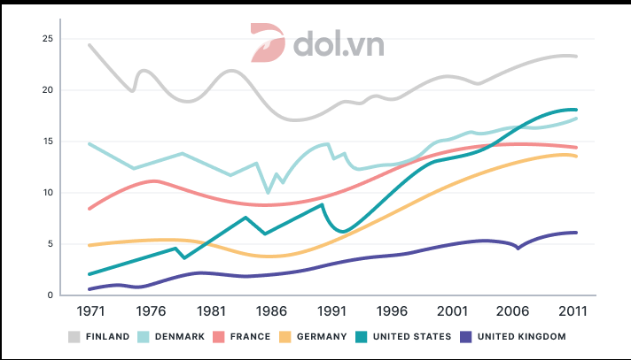

C1:The number of tourists who stayed on a cruise ship during their trips to this island increased from 250,000 in 2010 to 500,000 in 2011.
C2: In 2010, only around 250,000 visitors who travelled to this island stayed on a cruise ship, however, the number increased steadily to 500,000 only one year after.

## Introduction:
The line chart provides information about the numbers of tourist who wen to a Caribbean island and chose between two different accommodation types from 2010 to 2017.
## Overview:
Overall, the number of visitors staying on a cruise ship or on the island had increased significantly over the time, resulting in a massive leap in the number of tourist visiting this location.
## Main part:
### Trend 1:
#### C1:
The number of visitor who travelled to this island and stayed on it stabilized at around 750,000 in the first two years before increasing to a peak of 1.5 million in 2013, 2014, and 2015. After  experiencing a slight decrease of around 250k in 2016, it increased back to the previous peak in 2017.
#### C2:
In the first two years, around 750k visitors stayed on the island during their trips. The number then increased steadily to a peak of 1.5 million in 2013 and stayed at this level until 2015. Although it slight decreased in 2016, it surged back to the previous peak in 2017.
### Trend 2:
#### C1:
The number of visitors to this island who settled on a cruise ship during their trips increased from 250k to 500k between the first two years before plunging back to the starting level in 2012. The popularity of staying on a cruise ships rocketed afterwards, as in 2017, around 2 million passengers chose this accommodation type, surpassing the number of individuals who stayed on the island.

	Chat gpt fix: Notably, it was in the final two years that the popularity of cruise ships overtook that of island stays, marking a significant shift in tourist preferences.
#### C2:
After fluctuating between 250k to 500k in the first three years of this period, the number of visitors who chose cruise ships surged consistently in the next five years, eventually peaking at 2 million in 2017. Remarkably, the popularity of this accommodation type surpassed the preference for staying on the island in the last two years.
### Trend 3(total line):
Thanks to the massive increases in the number of visitors choosing both types of accommodation, the total number of passengers to this island had jumped impressively from only 1 million in 2010 to 3.5 million in 2017, constituting a more than 3-folds surge.

# Conclusion
The line chart provides information about the numbers of tourist who wen to a Caribbean island and chose between two different accommodation types from 2010 to 2017. Overall, the number of visitors staying on a cruise ship or on the island had increased significantly over the time, resulting in a massive leap in the number of tourist visiting this location.
The number of visitor who travelled to this island and stayed on it stabilized at around 750,000 in the first two years before increasing to a peak of 1.5 million in 2013, 2014, and 2015. After  experiencing a slight decrease of around 250k in 2016, it increased back to the previous peak in 2017. After fluctuating between 250k to 500k in the first three years of this period, the number of visitors who chose cruise ships surged consistently in the next five years, eventually peaking at 2 million in 2017. Remarkably, the popularity of this accommodation type surpassed the preference for staying on the island in the last two years. Thanks to the massive increases in the number of visitors choosing both types of accommodation, the total number of passengers to this island had jumped impressively from only 1 million in 2010 to 3.5 million in 2017, constituting a more than 3-folds surge.

# The banana trend

### By Jeremy 

The line graph illustrates the cost per kilogram of bananas in four different countries from 1994 to 2004.

Overall, it is clear that banana prices rose in all countries except Germany. Throughout the period, Japan consistently registered the highest cost per kilogram.

In 1994, the per kilogram of bananas differed markedly among the four markets. Specifically, Japanese consumers paid about 1.60 dollars, while shoppers in France faced a price of 1.5 dollars. Meanwhile, shoppers in Germany paid roughly 1.2 and in the United States the cost was just under 1.00 dollars.

Thereafter, Japan’s banana market peaked early, surging to about 2.9 dollars in 1995, then falling to approximately 1.9 dollars by 1997. A rebound pushed prices up to 2.30 dollar in 1999, followed by a dip back to 1.60 in 2001, before climbing again to around 2.60 in 2004. France’s price rose modestly to 1.7 dollars by 1999, dropped to 1.3 dollars in 2000 and hit a low of about 1.00 in 2003, then recovered to 1.60 in 2004. Germany experienced a gradual decline from 1.20 to 1.30 dollar in 1995 and ended the period at 1.2. In the USA, prices roses to 1.2 in 1995, dipped to roughly 1.00 by 1997, and subsequently stabilised at about 1.2 through 2004. 

### By AI

The line graph compares the price per kilogram of bananas in Japan, France, Germany, and the USA from 1994 to 2004.

Overall, the cost of bananas rose in all countries except Germany, which experienced a slight decline. Japan consistently recorded the highest prices throughout the period.

In 1994, Japan had the most expensive bananas at around $1.60 per kilo, followed by France at $1.50. The price in Germany was approximately $1.20, while the US had the lowest at just under $1.00.

In Japan, prices peaked sharply at nearly $2.90 in 1995, then dropped to around $1.90 by 1997. Despite fluctuations, they climbed again to approximately $2.60 by the end of the period. France saw a modest increase to $1.70 by 1999, but this was followed by a drop to about $1.00 in 2003 before recovering slightly. Meanwhile, prices in Germany declined gradually to $1.10 in 2004. The US market remained relatively stable, fluctuating between $1.00 and $1.20.

---

The line chart depicts the rate of renewable energy consumption in different countries from 1971 to 2011. 

Overall, six countries showed an increased in use of renewable energy. Throughout the period, Finland consistently registered the top of the list despite a slight drop in 2011. 

In 1971, Finland topped the list with nearly 25%. Following is Denmark

[Overview brief](Overview%20brief.md)
[Vocabulary](Vocabulary.md)
[Grammar](1747055526-PEXQ.md)

