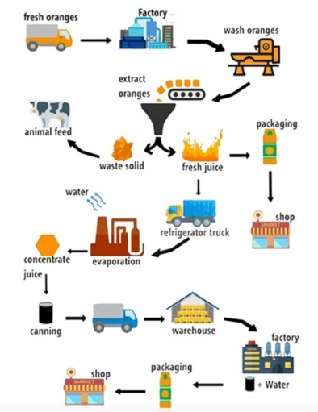

# Man-made process

### The diagram details the process of producing olive oil. Write a report for a university lecturer describing the information below.

#### By Jeremy

The flow chart describes step-by-step approaches how olive oil is produced. 

Overall , it is clear that there are seven main steps in the process, commencing with harvesting olives and culminating with delivering the final products to the market.

The process begins when olives are picked manually by gardeners. Next, the olives are moved to a rinsing machine where they are washed thoroughly with cold water. Thank to a conveyor belt, the clean olives are subsequently transferred to a smashing machine to be smashed into an olive paste with olive stones being released as a by-product.

Afterwards, whereas the olive stones are discarded, the olive paste is packed into bag with holes. The products are then pressed by a pressing machine, before being separated into oil and water. While the excess water is eliminated, the oil is finally distributed to stores for storage, sales and consumption.

- [x]    Band overall 6.5
- [x]    Task achievement 7.0 

#### By AI

The diagram elucidated the sequential process involved in the production of olive oil.

It is evident that the olive oil production process is comprised of seven distinct stages, begining whith the manual haresting of olives and concluding with the distribution of the final product to the market.

The initial step involves the meticulous manual harvesting of olives by skilled gardeners. Subsequently, the harvested olives are transferred to a rinsing machine, where they are thoroughly cleansed with cold water to remove impurities. Following this, the clean olives are conveyed via conveyor belt to a smashing machine, where they are effectively crush into a paste. It is noteworthy that this stage also results in the extraction of olive stones, which are classified as a by-product. 

In the following stage, the olive paste is placed into perforated bags to facilitate the separation of oli from water. The paste is then subjected to a pressing machine, where the oil is extracted while excess water is separated. Ultimately, the resulting olive oil is collected and prepared for distribution, ensuring that it reaches retailers for subsequent sale and consumer use.

### The diagram below shows how orange juice is produced. 

#### By Jeremy

The diagram illustates the sequential process involved in the production of orange juice.

Overall, it is clear that the orange juice production process is comprised of twelve distinct stages, commencing with harvesting oranges and culminating with delivering the final products to the market.

The process begins with fresh oranges are harvested by skilled gardeners and then transported into factories. Subsequently, the harested oranges are washed in a rinsing machine, before beging extracted into fresh juice with waste solids being released as a by-product. Whereas the solid is used to feed cattle, the juice left is either packaged to be delivered to shops for consumption and saled or loaded into a refrigerator truck.

In the following stage, the cooled juice evaporated, forming concentrated juice. Following this, as long as they are packed into cans, the products are transported to another factory to experience a treating stage in which water is added. Ultimately, the process ends with the final products is collected and prepared for distribution, ensuring that it reaches retailers for subsequent sale and consumer use.

- [x]     Overall 5.5
- [x]     Coherence and Cohesion: 5.5
- [x]     Resource: 5.5
- [x]     Grammatical Range and Accuracy: 5.5
- [x]     Task Achievement: 6.0

#### By AI 

The diagram illusttes the steps involved in the production and distribution of orange juice.

Overall, it is clear that the process consists of twelve stages, starting from the harvesting of oranges and ending wiht the distribution of orange juice products to retailers.

Initially, ripe oranges are harvested by farm worker and then transported by truck to a factory. Upon arrival, the fruits are washed using a rinsing machine before being squeezed to extract juice. The leftover solid waste is separated and used as cattle feed, while the the liquid juice is either packaged for direct sale or stored in refrigerated trucks for further processing.

In the following stsage, the juice is cooled and then undergoes evaporation to remove excess water, resulting in a concentrated form. This concentrate is store in cans and sent to another facility, where water is re-added to restore its liquid state. Finally, the reconstituted juice is packaged and distributed to supermarkets and shops for consumer purchase. Throuhout the process, the juice undergoes both mechanical and chemical stages to ensure it is sale and ready for public consumption.

[Vocabulary](Vocabulary.md)

